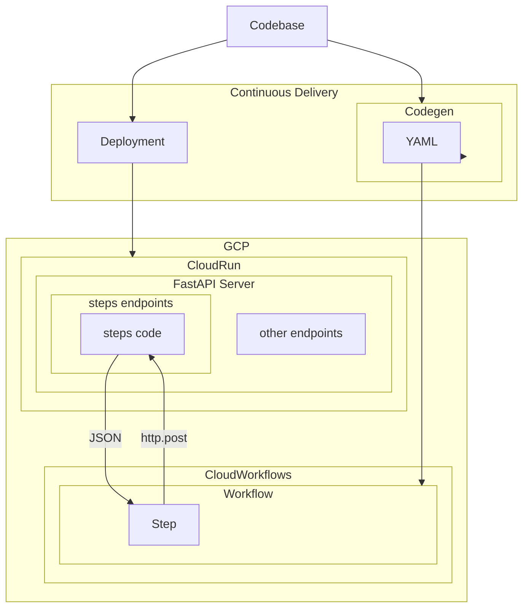

[](https://qlty.sh/gh/flamingo-run/projects/fastapi-google-workflows)
[](https://qlty.sh/gh/flamingo-run/projects/fastapi-google-workflows)
[](https://github.com/flamingo-run/fastapi-cloud-workflows/actions/workflows/ci.yml)


# FastAPI Cloudflow

Typed, ergonomic Google Cloud Workflows backed by FastAPI apps.

Write typed steps as normal async functions, compose them with `>>`, and generate/deploy Cloud Workflows while the framework exposes first-class FastAPI step endpoints for you.

## Why it’s useful
- Define workflows in pure, typed Python (Pydantic IO models)
- Reuse your FastAPI app: framework attaches `/steps/<name>` endpoints automatically
- Generate stable Cloud Workflows YAML from your Python composition
- Works great with CI (codegen snapshots) and smoke tests against real GCP

## Tiny example
```python
from pydantic import BaseModel
from fastapi_cloudflow import Context, step, workflow

class CreateOrder(BaseModel):
    account_id: int
    sku: str
    qty: int

class OrderDraft(BaseModel):
    order_id: str
    status: str

class OrderPlaced(BaseModel):
    order_id: str
    status: str

@step(name="price-order")
async def price_order(ctx: Context, data: CreateOrder) -> OrderDraft:
    return OrderDraft(order_id="o-123", status="priced")

@step(name="confirm-order")
async def confirm_order(ctx: Context, data: OrderDraft) -> OrderPlaced:
    return OrderPlaced(order_id=data.order_id, status="approved")

ORDER_FLOW = (workflow("order-flow") >> price_order >> confirm_order).build()
```
- Run `fastapi-cloudflow build` and you’ll get `order-flow.yaml`
- Attach to your FastAPI app and the framework exposes `POST /steps/price-order` with typed IO

## How it works (high-level)


- You write typed steps and compose with `workflow(...) >> step_a >> step_b`
- The CLI emits Cloud Workflows YAML that uses `http.post` to call the attached FastAPI step endpoints
- The framework injects a workflow context into each request (headers include name/run-id), and returns typed JSON bodies

## Try the examples
- See `examples/app/flows`: playful multi-step workflows
  - `echo_name.py` → echo-name-flow: echo → extract → shout
  - `post_story.py` → post-story-flow: build story → POST external → summarize
  - `jokes.py` → joke-flow: fetch → split → rate

## Codegen & tests
- Codegen snapshots: `uv run -q pytest -q tests/codegen` (full-file YAML equality)
- Unit tests: `uv run -q pytest -q tests/unit` (hits `/steps/<name>` endpoints with TestClient)
- Smoke tests: `uv run -q python tests/smoke/run_smoke.py --region us-central1` (requires GCP & deployed example)

## Supported features (Cloud Workflows)

| Feature | Status | Notes |
| --- | --- | --- |
| HTTP calls (http.get/post/…) | ✅ | `HttpStep`; custom headers, method |
| Auth to Cloud Run (OIDC audience) | ✅ | Python steps bake OIDC with `audience=BASE_URL` |
| Step timeouts | ✅ | `HttpStep(timeout=…)` emits seconds |
| Variables / assignment | ✅ | payload propagation + adapters/typed steps |
| Expressions (concat/env/params) | ✅ | `Arg.env/param/ctx`, string concat and path join |
| Sequential composition | ✅ | `workflow(...) >> step_a >> step_b` |
| Workflow input/output | ✅ | single `payload` param; final `return: ${payload}` |
| Error surfacing | ✅ | HTTP errors propagate; FastAPI returns typed 4xx/5xx |
| Retries | ⏳ | planned `RetryPolicy` emission |
| Try/catch | ❌ | not yet |
| Conditionals / switch | ❌ | not yet |
| Loops | ❌ | not yet |
| Parallel branches / join | ❌ | not yet |
| Subworkflows / call other workflows | ❌ | not yet |
| GCP connectors / direct service calls | ❌ | not yet |

## Next steps
- Open CONTRIBUTING.md for local setup, structure, and contribution checklist
- Use descriptive names for workflows/steps and prefer multi-step workflows that show transformations

